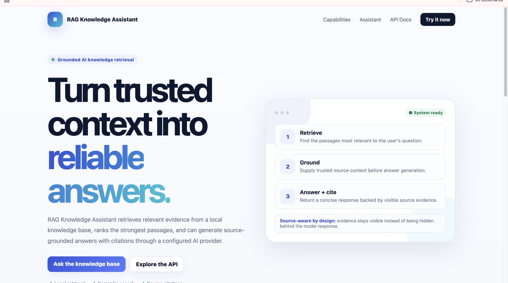
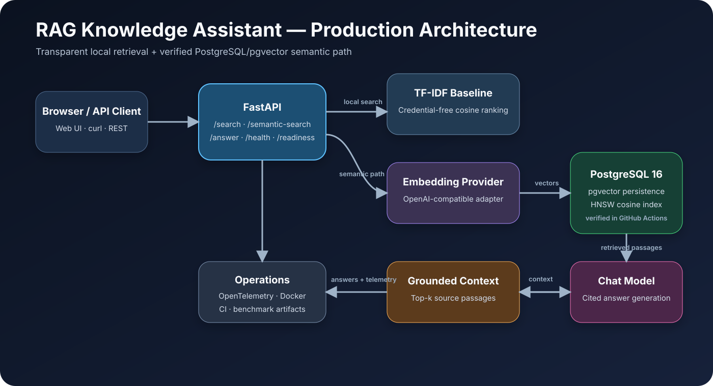

# RAG Knowledge Assistant

[](https://github.com/mirrazaabbas/rag-knowledge-assistant/actions/workflows/ci.yml)

A source-grounded RAG portfolio project with FastAPI, a transparent TF-IDF baseline, PostgreSQL/pgvector semantic retrieval, cited answer generation, Docker, CI, benchmark evidence, and deployment infrastructure.

**[Architecture](docs/images/rag-architecture.svg) · [Benchmark Method](docs/BENCHMARKING.md) · [Demo Walkthrough](docs/PORTFOLIO_DEMO.md) · [Deployment Guide](docs/DEPLOYMENT.md)**

## Application Preview



## Verified engineering evidence

- CI across Python 3.10, 3.11, and 3.12
- real PostgreSQL 16 + pgvector integration tests in GitHub Actions
- persistent vector upsert + cosine search verified end to end
- `/semantic-search` uses pgvector when `DATABASE_URL` is configured
- production Docker image built and smoke-tested using a platform-style `PORT`
- reproducible benchmark artifact generated by CI
- Render Blueprint included for cloud deployment

### Latest CI benchmark sample

| Metric | TF-IDF baseline | pgvector pipeline |
|---|---:|---:|
| Recall@3 | 1.00 | 1.00 |
| MRR | 0.875 | 1.00 |
| Median retrieval latency | 0.075 ms | 12.189 ms |

These results come from a four-case GitHub-hosted CI benchmark. The pgvector benchmark uses deterministic local feature vectors to verify retrieval plumbing and ranking behavior; it is **not** presented as a commercial embedding-model quality benchmark. Latency is environment-dependent.

See [docs/BENCHMARKING.md](docs/BENCHMARKING.md) for methodology and accuracy boundaries.

## Architecture



The application deliberately keeps a credential-free baseline alongside the semantic production path. FastAPI routes local search through TF-IDF, while configured semantic requests use an embedding provider plus PostgreSQL/pgvector and feed top-k grounded passages into cited answer generation.

See [ARCHITECTURE.md](ARCHITECTURE.md) for the detailed design.

## Implemented features

- Recursive `.md` / `.txt` ingestion and overlapping chunks
- TF-IDF weighting and cosine retrieval implemented from scratch
- source attribution and top-k ranking
- FastAPI REST API with Pydantic validation
- `GET /health` and `GET /readiness`
- `POST /search` credential-free local retrieval
- `POST /semantic-search` semantic retrieval with pgvector when configured
- `POST /answer` grounded cited answer generation
- built-in browser UI served from `/`
- OpenAI-compatible provider adapter
- PostgreSQL/pgvector persistence with validated vector dimensions
- HNSW cosine index
- Docker Compose stack
- optional OpenTelemetry FastAPI instrumentation
- real pgvector integration tests
- reproducible benchmark runner + workflow artifact
- production container build/smoke test in CI
- Render deployment Blueprint
- safe 503 behavior when provider credentials are unavailable

## Run locally

```bash
python -m pip install -r requirements.txt
uvicorn api:app --reload
```

Open:

- Web UI: `http://127.0.0.1:8000/`
- OpenAPI docs: `http://127.0.0.1:8000/docs`
- Readiness: `http://127.0.0.1:8000/readiness`

Credential-free retrieval:

```bash
curl -X POST http://127.0.0.1:8000/search \
  -H "Content-Type: application/json" \
  -d '{"query":"How can AI agents reduce unsupported claims?","top_k":3}'
```

## Production-oriented stack

```bash
python -m pip install -r requirements-production.txt
docker compose up --build
```

This starts FastAPI with PostgreSQL 16 + pgvector. The production retrieval path creates the vector extension/schema, persists chunks, and performs nearest-neighbor retrieval.

## Cloud deployment

`render.yaml` defines a Docker web service plus managed PostgreSQL. The production container honors the deployment platform's `PORT` environment variable and uses `/health` for service checks.

See [docs/DEPLOYMENT.md](docs/DEPLOYMENT.md) for the exact deployment and verification procedure.

A public **Live Demo** link will be added here only after the external Render deployment has actually been created and verified.

## Observability

```bash
OTEL_ENABLED=true
OTEL_SERVICE_NAME=rag-knowledge-assistant
```

The included implementation uses a console span exporter as a safe default. A real observability backend remains a separate deployment step.

## Quality checks

```bash
python -m pip install -r requirements-dev.txt
ruff check .
coverage run -m unittest discover -s tests -v
coverage report --fail-under=80
```

GitHub Actions additionally starts a real pgvector service, executes integration tests, runs the retrieval benchmark, uploads the raw benchmark JSON, builds the production Docker image, and smoke-tests its health/readiness endpoints.

## Security

Provider and database credentials are environment-based and never committed. Retrieved documents are treated as untrusted data. See [SECURITY.md](SECURITY.md) for production controls and limitations.

## Remaining milestones

- create and verify the public cloud deployment / Live Demo
- run a deliberately authorized live embedding + chat provider benchmark
- connect OpenTelemetry to a real collector/backend
- add prompt-injection/adversarial evaluation
- add authentication/rate limiting before exposing write/upload functionality
- optionally add validated document/PDF upload and hybrid reranking

## Skills demonstrated

Python · FastAPI · Pydantic · RAG · Information Retrieval · Embeddings · LLM Integration · PostgreSQL · pgvector · Vector Search · HNSW · REST APIs · Source Grounding · Docker · Docker Compose · OpenTelemetry · Testing · CI/CD · Benchmarking · Cloud Deployment Configuration

## Scope and accuracy

The local baseline, PostgreSQL/pgvector integration path, integration tests, CI benchmark, deployment configuration, and production container verification are implemented and verified where stated. The repository does **not** claim a public cloud URL, live external-provider verification, or production tracing until those are actually performed.
