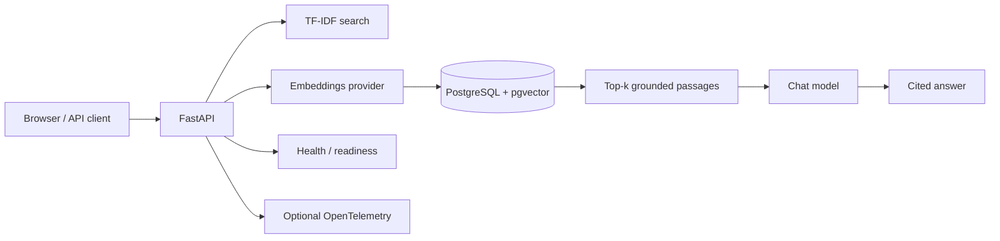

# Recruiter Demo Guide

## 60-second walkthrough

1. Open the browser UI and run a local grounded search.
2. Show the returned source path and ranked passage.
3. Open `/docs` to show the FastAPI contract.
4. Open `/readiness` to show production dependency reporting.
5. Show the GitHub Actions workflow with Python 3.10-3.12 tests and a real PostgreSQL/pgvector integration job.
6. Show `render.yaml` as infrastructure-as-code for the public deployment path.
7. Show `docs/BENCHMARKING.md` and the CI benchmark artifact as measured evidence.

## Architecture talking points

## What to say

The project starts with a transparent credential-free retrieval baseline and then adds a separately verified production path. PostgreSQL/pgvector persistence and cosine retrieval are exercised against a real database in CI. External provider credentials, cloud deployment, and live-model benchmarks remain separate so the repository does not claim results that were not actually verified.

## Evidence links inside the repository

- `README.md` — project overview and run instructions
- `ARCHITECTURE.md` — detailed design
- `docs/DEPLOYMENT.md` — local and cloud deployment path
- `docs/BENCHMARKING.md` — benchmark method and results boundaries
- `.github/workflows/ci.yml` — automated verification
- `tests/test_pgvector_integration.py` — database-backed integration coverage
